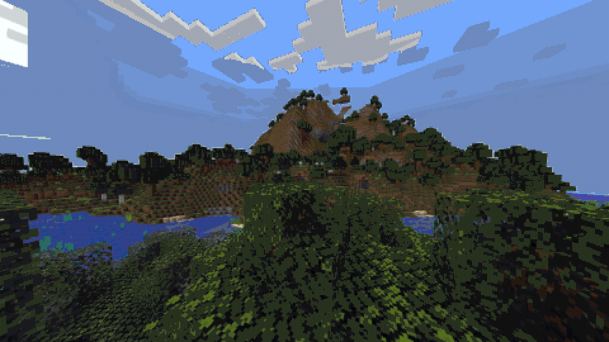
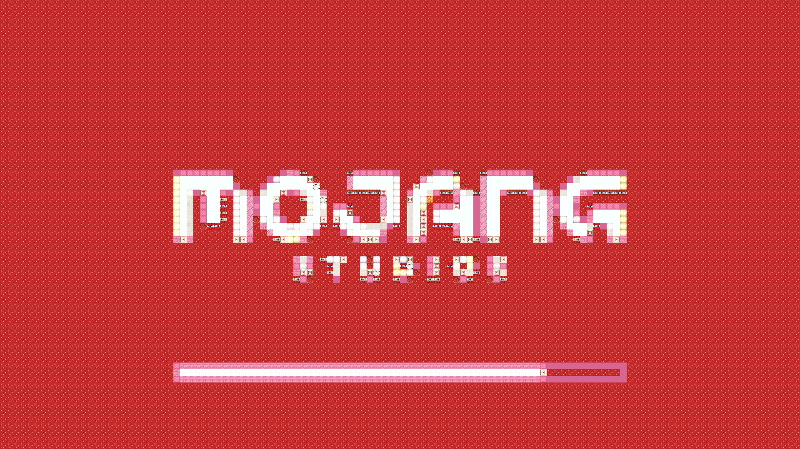
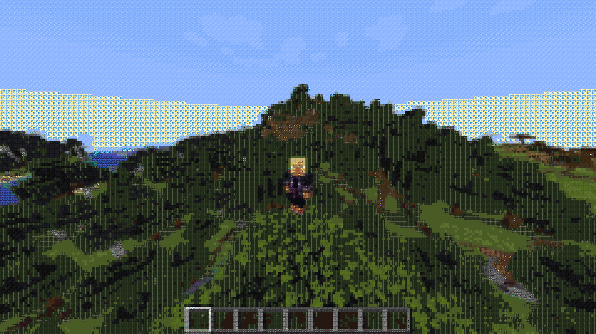

# About

This is a simple fabric mod/shader that renders your game only from Minecraft blocks!

It started as a small side-project of mine at the start of 2023 mostly inspired by [Fundy's "Minecraft in Minecraft" video](https://www.youtube.com/watch?v=BNwQf6nuvMc).
I firstly didn't plan to use shaders (nor I had experience with them) but redrawing the whole screen every frame from Java code was (unsurprisingly) VERY slow.
That was the main reason I made a simple shader for it instead. Which is considerably faster.

I am quite happy with how it turned out, and it's still one of my favourite projects.

I don't plan to really support/maintain this project and am not entirely sure how stable/supported it is on difference devices.

## Features
The shader can be enabled/disabled with **left shift**. There is a slide-bar in options screen to change the blocks size in pixels (16, 8, 4, 2 or 1). I personally feel like 8 or 4 are the best ones.

# Showcase

